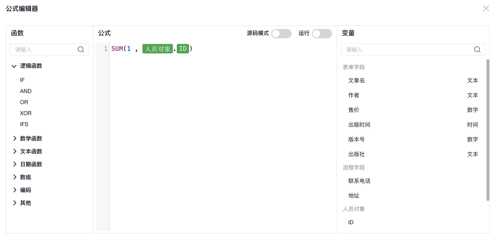

# 公式编辑器

支持自定义函数和特殊数据类型的公式编辑器


## 一些概念

- `lexer` 词法分析
- `parser` 词法解析
- `AST` 抽象语法树

## 编译（compiler）过程

```
     lexer         parser
code -----> token --------> AST
```

## TODO list

- [ ] lexer 词法分析，将代码字符串解析成一个个 `token`
- [ ] parser 语法分析，自定义编程语言，`token` 按规则生成 `AST`
- [ ] runtime，在 `AST` 中注入自定义函数和自定义数据
- [ ] IDE plugin，支持代码输入和特殊数据标注

## 参考

- 《两周自制脚本语言》
